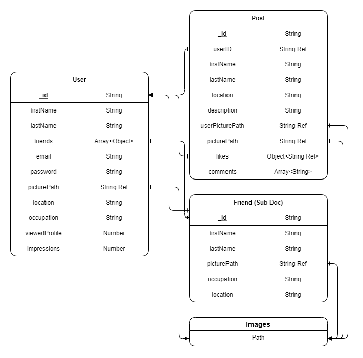

# Scociopedia

A full-stack web application built using the MERN stack (MongoDB, Express.js, React, and Node.js).

## Built With

- [Node.js](https://nodejs.org/) - JavaScript runtime
- [Express.js](https://expressjs.com/) - Web framework for Node.js
- [React](https://reactjs.org/) - JavaScript library for building user interfaces
- [MongoDB](https://www.mongodb.com/) - NoSQL document-oriented database

## Entity Relationship Diagram

