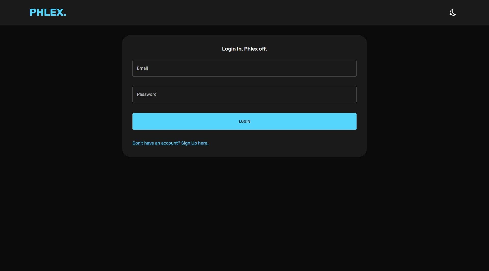
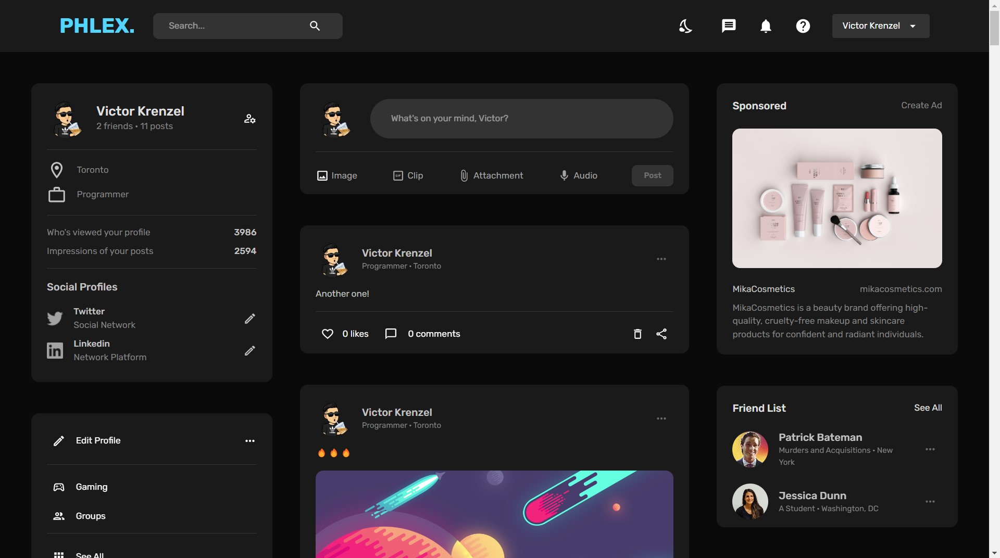
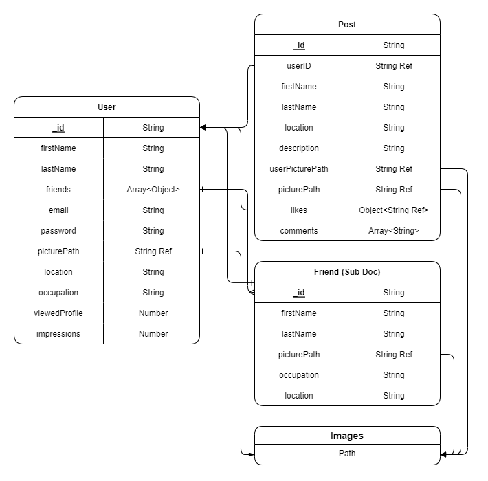

# Phlex

A full-stack web application built using the MERN stack (MongoDB, Express.js, React, and Node.js).

# Screenshots

## Built With

- [Material-UI](https://material-ui.com/) - A popular UI library for creating beautiful and responsive user interfaces
- [Redux Toolkit](https://redux-toolkit.js.org/) - A powerful set of utilities for simplifying the creation of Redux stores and actions
- [React Router](https://reactrouter.com/) - A library for handling client-side routing in React apps
- [Redux Persist](https://github.com/rt2zz/redux-persist) - A library for persisting the state of a Redux store to local storage
- [React Dropzone](https://react-dropzone.js.org/) - A library for handling file uploads in React apps
- [Node.js](https://nodejs.org/) - A JavaScript runtime for building server-side applications
- [Nodemon](https://nodemon.io/) - A utility that automatically restarts a Node.js server when changes are detected
- [NPX](https://www.npmjs.com/package/npx) - A package runner that comes with npm
- [Visual Studio Code](https://code.visualstudio.com/) - A popular code editor developed by Microsoft
- [Dotenv](https://www.npmjs.com/package/dotenv) - A library for loading environment variables from a .env file
- [MongoDB](https://www.mongodb.com/) - A popular NoSQL database for storing and querying data
- [Mongoose](https://mongoosejs.com/) - A library for interacting with MongoDB in a Node.js app
- [JsonWebToken](https://jwt.io/) - A library for generating and validating JSON web tokens
- [Multer](https://www.npmjs.com/package/multer) - A library for handling file uploads in a Node.js app
- [GridFS-Storage](https://www.npmjs.com/package/gridfs-storage) - A library for storing large files in MongoDB using GridFS
- [Google Fonts](https://fonts.google.com/) - A library for easily adding custom fonts to a website
- [Formik](https://formik.org/) - A library for managing form state and validation in React
- [Yup](https://github.com/jquense/yup) - A library for defining and validating object schemas in JavaScript

## Features
- User registration and login
- CRUD functionality
- Responsive design for mobile devices
- Image upload and storage
- User authorization and authentication 
- Dark mode toggle
- User likes & dislikes

## Visual Data Model

